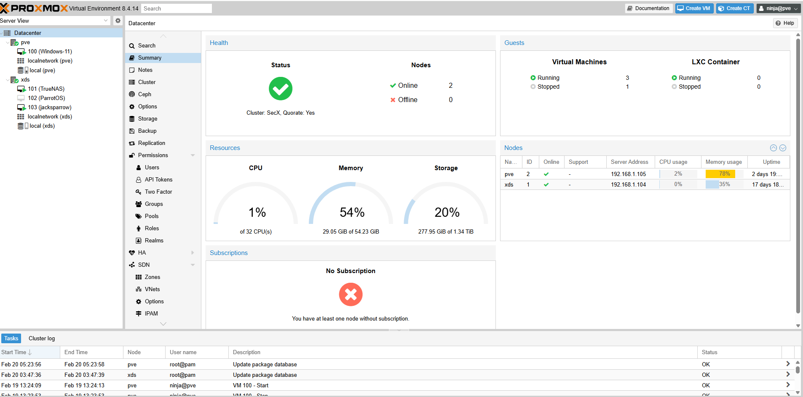

## 📌 Project Overview

This project demonstrates the design, deployment, and management of a **2-node Proxmox VE (Type-1 Hypervisor) cluster** simulating an enterprise infrastructure environment.

The lab was built to simulate:

- Enterprise virtualization architecture
- Distributed cluster configuration with quorum
- Centralized storage integration
- Security monitoring & log aggregation
- Network segmentation & firewall enforcement
- Endpoint security monitoring
- Infrastructure documentation & control validation

The environment reflects enterprise-grade virtualization and security operations practices.

---

## 🏗️ Cluster Architecture

### 🔹 Cluster Details

- **Cluster Name:** SecX
- **Nodes:**
  - `pve` – 192.168.1.105
  - `xds` – 192.168.1.104
- **Quorum:** Enabled
- **Total CPU Cores:** 32
- **Total Memory:** ~54 GB
- **Total Storage:** ~1.34 TB
- **Proxmox Version:** 8.x

Both nodes are synchronized and actively participating in cluster operations.

---

## 💻 Virtual Machines Deployed

### 🔹 Infrastructure Systems

| VM ID | OS | Purpose |
|-------|----|----------|
| 100 | Windows 11 | Domain-joined endpoint testing |
| 101 | TrueNAS | Centralized storage server |
| 102 | Parrot OS | Security testing environment |
| 103 | Security VM | Adversary simulation & log generation |

---

## 🌐 Network Design

- Layered segmentation using virtual bridges
- Static IP configuration
- Firewall rule enforcement and logging
- Secure remote VPN overlay
- DNS-level filtering and monitoring
- IDS log forwarding to SIEM

---

## 📊 Resource Monitoring

Cluster status monitored via:

- Proxmox Datacenter dashboard
- SIEM dashboards (Wazuh / Elastic)
- System logs and IDS alerts

### Current Cluster Health (Sample Snapshot)

- CPU Usage: ~1%
- Memory Usage: ~53%
- Storage Usage: ~20%
- 3 Virtual Machines running
- Cluster quorum maintained
- All nodes online

---

## 📖 Documentation Practices

This project emphasizes:

- Structured configuration documentation
- Security runbook creation
- Firewall rule documentation
- Detection workflow mapping
- MITRE ATT&CK technique mapping
- Organized artifact repository

---

## 🧠 Lessons Learned

- Importance of quorum in distributed systems
- Resource planning in clustered environments
- Secure segmentation design principles
- Log normalization challenges
- Documentation discipline for reproducibility
- Integration of network and endpoint telemetry

---

## 🚀 Future Improvements

- Implement High Availability (HA) failover
- Automate deployment using Ansible/Terraform
- Add backup replication testing
- Integrate cloud-based SIEM (e.g., Microsoft Sentinel)
- Add vulnerability scanning automation

---

## 📎 Screenshot

---

## 📌 Project Purpose

This lab was built to simulate enterprise infrastructure and security operations in a controlled environment, demonstrating virtualization management, network security, centralized monitoring, and structured documentation practices.

---
